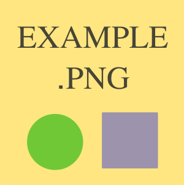
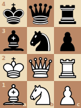

# mdcat

A terminal Markdown renderer with inline images, tables, and hyperlinks.
Companion pager `gmore` handles sixel graphics natively.

## Features

### Headings

Six heading levels with distinct underline styles (heavy → light → dotted →
dashed) so hierarchy is immediately visible. Inline markup works inside
headings: ***bold italic*** and `code` render correctly.

### Inline styling

*Italic*, **bold**, `code spans`, and [hyperlinks](https://example.com) all
render with appropriate terminal styling — markup characters are consumed,
not printed. Hyperlinks use OSC 8 escape sequences, which are clickable in
iTerm2, Kitty, WezTerm, and most modern terminals.

### Tables

GFM tables render with a bold header row, a full-width rule, and column
separators. Long cells wrap within their column; narrow terminals compress
columns gracefully.

Per-column alignment from the delimiter row is honored: `:---` (or plain `---`)
left-aligns, `:--:` centers, and `---:` right-aligns. The chosen alignment
applies to the header, the body cells, and every line of a cell that wraps.

Alignment also holds across wrapping. In a narrow terminal the description
column below wraps onto several lines; the left column stays flush left, the
numeric column stays flush right, and the centered notes stay centered — line by
line.

| Opening          | Idea                                                      | Eval |
| :--------------- | :------------------------------------------------------: | ---: |
| Ruy Lopez        | White pins the knight that defends e5, then slowly builds a strong pawn center with d4 and c3. | +0.3 |
| Sicilian Defense | Black answers 1.e4 with c5, side-stepping a symmetric position and fighting for the center asymmetrically from the start. | -0.1 |
| French Defense   | Black plays ...e6 and ...d5 to challenge the center early, accepting a cramped but solid and resilient pawn structure. | +0.2 |

### Images

Inline `` tags and `` links render as actual images on
sixel-capable terminals (iTerm2, VSCode, WezTerm, xterm with sixel enabled).
Images are scaled to fit the available column width while preserving aspect
ratio. Supported formats: **PNG**, **JPEG**, **GIF**, **SVG** (via
[timg](https://github.com/hzeller/timg)).

Image paths are resolved relative to the markdown file's directory. On
terminals without sixel support (Apple Terminal, plain xterm, piped output)
the image falls back to its alt text, or the filename if no alt is given.

| PNG | JPEG | GIF | SVG |
| --- | ---- | --- | --- |
|  |  |  |  |

### Block quotes

Block quotes render with a left-rule decoration; nesting is supported.

> A block quote with a left-rule decoration.
>
> > Nested quote one level deeper.
>
> Back to the outer level.

### Lists

Bullet lists use depth-varying glyphs (•, ◦, ▪). Ordered lists honor custom
start numbers. Item bodies reflow and hang under the marker.

- Top level
  - Second level
    - Third level
  - Back to second
- Another top-level item with **bold** and `code` inline

1. Ordered lists work too
2. With correct numbering

### Code blocks

Fenced code blocks render on a light-gray background panel. When the opening
fence carries a language tag, syntax highlighting is applied: keywords in blue
bold, strings in dark red, comments in dark green italic, numbers in magenta,
and preprocessor directives in orange.

```cpp
/*
 * Compute n! iteratively.
 * Works for n <= 20 (fits in uint64_t).
 */
#include <cstdint>
#include <stdexcept>

uint64_t factorial(int n) {
    if (n < 0) throw std::invalid_argument("negative n");
    uint64_t result = 1;
    for (int i = 2; i <= n; ++i)
        result *= i;  // no overflow check — caller's responsibility
    return result;
}
```

```python
def factorial(n: int) -> int:
    """Return n!, raising ValueError for negative inputs.

    Uses iteration rather than recursion to avoid hitting
    Python's default recursion limit for large n.
    """
    if n < 0:
        raise ValueError(f"factorial requires n >= 0, got {n}")
    result = 1
    for i in range(2, n + 1):
        result *= i
    return result
```

### Math

LaTeX math between `$...$` (inline) and `$$ ... $$` (block) is transliterated to
Unicode on a best-effort basis: Greek letters, common operator and relation
symbols, super- and subscripts, blackboard-bold (`\mathbb`), and the
`\mathrm`/`\mathbf` font wrappers. Bare Latin letters render in math italic, as
they do in LaTeX. Anything that can't be mapped is left as the literal source,
so the output is never worse than the input.

The mass–energy equivalence is $E = mc^2$. For all $x \in \mathbb{R}$ there is a
$y$ with $x \leq y$, and Avogadro's number is $6.022 \times 10^{23}\,\mathrm{mol}^{-1}$.

$$a^2 + b^2 = c^2 \qquad \therefore c = \sqrt{a^2 + b^2}$$


## Programs

### mdcat

Renders Markdown to the terminal with ANSI styling, sixel images, and OSC 8
hyperlinks.

```
mdcat [--width N] [--img] [--] [file ...]
```

| Flag | Description |
| ---- | ----------- |
| `--width N` / `-w N` | Force render width in columns (overrides `$COLUMNS` and terminal size) |
| `--img` | Emit sixel output even when stdout is not a TTY (for piping into gmore) |
| `--` | End option parsing (allows filenames starting with `-`) |

Reads stdin when no files are given. Multiple files are concatenated.

### gmore

A graphics-aware pager that understands sixel images and OSC 8 hyperlinks.
`mdcat` pipes into it automatically when stdout is a TTY.

```
gmore [--dump] [--dump-images] [file]
```

| Key | Action |
| --- | ------ |
| `Space` / `f` | Page down |
| `b` | Page up |
| `Enter` / `j` | Line down |
| `k` / `y` | Line up |
| `q` | Quit |

## Requirements

- A C++17 compiler (clang or g++)
- [timg](https://github.com/hzeller/timg) for image rendering
- A sixel-capable terminal for inline images (optional — falls back to text)

## Building

```sh
make
make check   # run the test suite
```

Produces `./mdcat` and `./gmore`.

## Usage examples

```sh
./mdcat README.md                        # render a file
./mdcat --width 80 README.md             # force width
./mdcat --img README.md | ./gmore        # explicit pager
curl -s https://example.com/doc.md | ./mdcat   # render stdin
```
