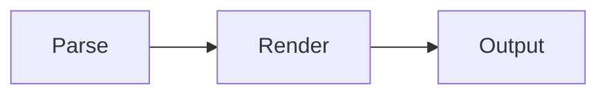

# mdcat

[](https://github.com/GeertBosch/mdcat/actions/workflows/ci.yml)

A terminal Markdown renderer with inline images, tables, and hyperlinks.
Companion pager `gmore` handles sixel and Kitty graphics natively, so images
keep working over SSH.

> Curious how images survive a terminal, a table, a pager, and an SSH hop? The
> [terminal-graphics field guide](docs/TERMINAL-GRAPHICS.md) is the nerd-focused
> tour of what we measured, broke, and now hold as ground truth.

## Features

### Headings (with _italics_ and `code`)

Six heading levels with distinct underline styles (heavy → light → dotted →
dashed) so hierarchy is immediately visible. Inline markup works inside
headings: ***italics*** and `code` render correctly.

### Inline styling

*Italic*, **bold**, `code spans`, and [hyperlinks](https://example.com) all
render with appropriate terminal styling — markup characters are consumed,
not printed. Hyperlinks use OSC 8 escape sequences, which are clickable in
iTerm2, Kitty, WezTerm, and most modern terminals.

### Tables

GFM tables render with a bold header row, a full-width rule, and column
separators. Long cells wrap within their column; narrow terminals compress
columns gracefully.

Per-column alignment from the delimiter row is honored: `:---` (or plain `---`)
left-aligns, `:--:` centers, and `---:` right-aligns. The chosen alignment
applies to the header, the body cells, and every line of a cell that wraps.

Alignment also holds across wrapping. In a narrow terminal the description
column below wraps onto several lines; the left column stays flush left, the
numeric column stays flush right, and the centered notes stay centered — line by
line.

| Opening          | Idea                                                      | Eval |
| :--------------- | :------------------------------------------------------: | ---: |
| Ruy Lopez        | White pins the knight that defends e5, then slowly builds a strong pawn center with d4 and c3. | +0.3 |
| Sicilian Defense | Black answers 1.e4 with c5, side-stepping a symmetric position and fighting for the center asymmetrically from the start. | -0.1 |
| French Defense   | Black plays ...e6 and ...d5 to challenge the center early, accepting a cramped but solid and resilient pawn structure. | +0.2 |

### Images

Inline `` tags and `` links render as actual
images on graphics-capable terminals. Images are scaled to fit the available
column width while preserving aspect ratio. Supported formats: **PNG**, **JPEG**,
**GIF**, **SVG** (via [timg](https://github.com/hzeller/timg)).

mdcat chooses a graphics protocol automatically: the **Kitty graphics protocol**
on terminals that support it (VSCode, iTerm2, Ghostty/Orbstack, Kitty, WezTerm),
falling back to **sixel** elsewhere. Kitty is preferred because it sizes images
in character cells, so they lay out correctly **over SSH** — the remote host
needn't know the local terminal's pixel geometry. On terminals without any
graphics support (Apple Terminal, plain xterm, piped output) the image falls
back to its alt text, or the filename if no alt is given.

Image paths are resolved relative to the markdown file's directory.

### Block quotes

Block quotes render with a left-rule decoration; nesting is supported.

> A block quote with a left-rule decoration.
>
> > Nested quote one level deeper.
>
> Back to the outer level.

### Lists

Bullet lists use depth-varying glyphs (●, ○, ▪︎). Ordered lists honor custom
start numbers. Item bodies reflow and hang under the marker.

- Top level
  - Second level
    - Third level
  - Back to second
- Another top-level item with **bold** and `code` inline

1. Ordered lists work too
2. With correct numbering

Task lists (the GitHub extension) render their checkboxes as ☐ and ☑:

- [x] Parse the checkbox marker
- [x] Render the glyph
- [ ] Anything still to do

### Code blocks

Fenced code blocks render on a background panel whose colours follow the
terminal theme, detected from its background (queried once via OSC 11). On a
**light** terminal the panel is light-gray with dark text and saturated
highlight hues; on a **dark** terminal it is dark-gray with light-gray text and
the same hues lightened to stay readable. When the opening fence carries a
language tag, syntax highlighting is applied: keywords in blue bold, strings in
red, comments in green italic, numbers in magenta, and preprocessor directives
in orange. Set `MDCAT_THEME=dark` or `=light` to override the auto-detection.

```cpp
#include <cstdint>
#include <stdexcept>

/*
 * Compute n! iteratively.
 * Works for n <= 20 (fits in uint64_t).
 */
uint64_t factorial(int n) {
    if (n < 0) throw std::invalid_argument("n < 0 in factorial");
    uint64_t result = 1;
    for (int i = 2; i <= n; ++i)
        result *= i;  // no overflow check — caller's responsibility
    return result;
}
```

```python
"""Return n!, raising ValueError for negative inputs.

Uses iteration rather than recursion to avoid hitting
Python's default recursion limit for large n.
"""
def factorial(n: int) -> int:
    if n < 0:
        raise ValueError("n < 0 in factorial")
    result = 1
    for i in range(2, n + 1):
        result *= i
    return result
```

### Math

LaTeX math between `$...$` (inline) and `$$ ... $$` (block) is transliterated to
Unicode on a best-effort basis: Greek letters, common operator and relation
symbols, super- and subscripts, blackboard-bold (`\mathbb`), and the
`\mathrm` / `\mathbf` font wrappers. Bare Latin letters render in math italic, as
they do in LaTeX. Anything that can't be mapped is left as the literal source,
so the output is never worse than the input.

The mass–energy equivalence is $E = m c^2$. For all $x \in \mathbb{R}$ there is a
$y$ with $x \leq y$, and Avogadro's number is $6.022 \times 10^{23}\, \mathrm{mol}^{-1}$.

$$a^2 + b^2 = c^2 \qquad \therefore \qquad c = \sqrt{a^2 + b^2}$$

**Display math stacks fractions.** In a `$$ ... $$` block a top-level
`\frac{...}{...}` is set in two dimensions the way TeX does it: the numerator
sits over the denominator, separated by a bar as wide as the wider side, each
side centered on the bar. The over/under layout already carries the grouping, so
the faint parentheses the inline form would wrap around a whole numerator or
denominator are dropped — only interior grouping (a nested `\sqrt`, say) keeps
its parens. Several fractions on one line share a common baseline:

$$\frac{-b \pm \sqrt{b^2 - 4ac}}{2a} \qquad \frac{5}{6 \cdot 7} \qquad \frac{5 \cdot 6}{7}$$

Inline `$...$` fractions and radicals stay on one line — a paragraph has no room
to grow vertically — so `\sqrt{...}` and `\frac{...}{...}` flatten as `√…` and
`…/…`, with grouping parentheses added only where the flattened form would
otherwise misgroup. A top-level sum or difference is always parenthesized; an
explicit product or division is grouped only in a denominator (it binds like the
fraction bar), while a single term, a numerator product, or implicit
multiplication such as `2a` stays bare. The parens are dimmed almost into the
background (near-white on a light theme, near-black on a dark one) so they read
as structure; the fraction bar itself keeps the normal foreground colour. For
example, $\frac{-b \pm \sqrt{b^2 - 4ac}}{2a}$ flattens inline, but the same
expression displayed above stacks.

### Mermaid diagrams

A fenced code block tagged `mermaid` is rendered as a real diagram when the
[mermaid CLI](https://github.com/mermaid-js/mermaid-cli) (`mmdc`) is installed
and the terminal supports sixel graphics. Otherwise — `mmdc` missing, or a
terminal that can't draw graphics — the block falls back to showing its source
as an ordinary code panel, so the document is never worse off than plain text.



### Unicode 🌍

Text is measured by *display width*, not byte or code-point count, so everything
stays aligned no matter the script. Wide characters (emoji 🎉 and CJK 漢字 かな
한글) take two columns; combining marks (café, naïve, Å), variation selectors
(❤️, ✈️), and ZWJ sequences (👩‍🚀, 👨‍👩‍👧‍👦, 🏳️‍🌈) collapse to a single
grapheme. Right-to-left scripts (العربية, עברית) and the full range of symbols
(✓ ✗ ★ ☂ ♞ ∑ ∞ ≈ µ Ω) pass through untouched.

Because alignment uses true width, a table of mixed scripts and emoji keeps its
columns flush — count the cells, not the bytes:

| Script   | Sample   | Flag |
| :------- | :------- | :--: |
| Latin    | mdcat    | 🇺🇸   |
| Japanese | 日本語   | 🇯🇵   |
| Korean   | 한국어   | 🇰🇷   |
| Emoji    | 👩‍🚀🚀🌕 | 🚩   |

#### Remote images and the trust list

An image whose `src` is a remote URL (like the CI badge at the top of this file)
is fetched and rendered too — but only from **trusted hosts**, and only over
**https**. Viewing a Markdown file should never quietly pull from an arbitrary
server, so the trust list is built from two sources, with no built-in defaults:

1. **Your git remotes.** Hosts you already push/pull to are trusted: mdcat reads
   the git remotes of the repository containing the file being rendered (both
   the `git@host:…` SSH form and the `https://host/…` URL form). That is why
   this README's `github.com` badge renders for anyone who has cloned the repo.
2. **A user config file** at `$XDG_CONFIG_HOME/mdcat/trusted-hosts` (or
   `~/.config/mdcat/trusted-hosts`): one host per line, `#` for comments. A bare
   `example.com` trusts exactly that host; a leading-dot or `*.` entry
   (`.example.com` / `*.example.com`) also trusts its subdomains.

Anything not on the list — an untrusted host, plain `http`, a URL with embedded
credentials — falls back to the alt text, exactly like a non-graphics terminal.
mdcat does the fetch itself with `curl` (https-only, redirect-following, with a
timeout and a size cap), then hands the bytes to the normal image pipeline.

> Why two protocols, and why a fractional cell breaks naive scaling? See
> [cells, pixels, and the 6-vs-14 problem](docs/TERMINAL-GRAPHICS.md#2-cells-pixels-and-the-6-vs-14-problem)
> in the field guide. Keeping images aligned inside a **table** has its own war
> story: [pin the footprint to the laid-out width](docs/TERMINAL-GRAPHICS.md#5-images-in-tables-pin-the-footprint-to-the-laid-out-width).

| PNG | JPEG | GIF | SVG |
| --- | ---- | --- | --- |
|  |  |  |  |

#### Remote sessions and overrides

Over SSH, mdcat detects the local terminal's capabilities through the pty, and
defaults to the Kitty protocol when it cannot tell (e.g. VSCode Remote-SSH, where
the terminal identity isn't forwarded).

> The full account — why `TIOCGWINSZ` pixels are 0 over SSH, why `CSI 16t` still
> answers through the pty, and why env vars can't be trusted — is in
> [over SSH: why Kitty, and how sizing still works](docs/TERMINAL-GRAPHICS.md#6-over-ssh-why-kitty-and-how-sizing-still-works).

**Forcing a protocol.** Two equivalent escape hatches pin the graphics backend
to `kitty`, `sixel`, or `none` (text-only): the `--img` flag with a protocol
argument (`mdcat --img sixel doc.md`) or the `MDCAT_GRAPHICS` environment
variable (`MDCAT_GRAPHICS=sixel mdcat doc.md`). The flag is handy ad hoc; the
env var forwards over SSH with `ssh -o SendEnv=MDCAT_*`. Either overrides
auto-detection.

If a remote session can't query the local cell size, supply it with
`MDCAT_CELL_W` / `MDCAT_CELL_H` (and optionally `MDCAT_AREA_W` / `MDCAT_AREA_H`)
— e.g. forward them with `ssh -o SendEnv=MDCAT_*`.

## Programs

### mdcat

Renders Markdown to the terminal with ANSI styling, inline images (Kitty or
sixel graphics), and OSC 8 hyperlinks.

```
mdcat [--width N] [--img[=kitty|sixel|none]] [--] [file ...]
```

| Flag | Description |
| ---- | ----------- |
| `--width N` / `-w N` | Force render width in columns (overrides `$COLUMNS` and terminal size) |
| `--img` | Emit image output even when stdout is not a TTY (for piping into gmore) |
| `--img <kitty\|sixel\|none>` | As `--img`, but also force the graphics protocol (`none` = text only). Same effect as `MDCAT_GRAPHICS`. Accepts `--img sixel` or `--img=sixel` |
| `--` | End option parsing (allows filenames starting with `-`) |

| Environment | Description |
| ----------- | ----------- |
| `MDCAT_GRAPHICS` | Force the image protocol: `kitty`, `sixel`, or `none` |
| `MDCAT_CELL_W` / `MDCAT_CELL_H` | Local terminal cell size in pixels (for remote sessions that can't query it) |
| `MDCAT_AREA_W` / `MDCAT_AREA_H` | Local terminal text-area size in pixels (for an exact pixel↔cell ratio) |

Reads stdin when no files are given. Multiple files are concatenated.

### gmore

A graphics-aware pager that understands sixel **and Kitty** images plus OSC 8
hyperlinks. `mdcat` pages through `gmore` by default when stdout is a TTY. For
Kitty
images it transmits each image to the terminal once, then paints the visible
band on every scroll with a cheap crop placement — no per-scroll re-encode — so
scrolling stays smooth and images render correctly over SSH.

> Why a pager paints images one 18-px strip at a time, and why scrolling up is
> harder than scrolling down, is covered in
> [paging images: the 18-px strip, and scroll asymmetry](docs/TERMINAL-GRAPHICS.md#4-paging-images-the-18-px-strip-and-scroll-asymmetry).

```
gmore [--dump | --dump-images | --imginfo] [file]
```

Reads stdin when given no file (or `-`). gmore does not choose a graphics
protocol itself: it replays whatever image bytes are in the stream (sixel or
Kitty, detected per image), so the protocol is whatever `mdcat` emitted — pick it
on the `mdcat` side with `--img <proto>` or `MDCAT_GRAPHICS`.

When stdout is not a terminal (for example `... | gmore | head -2`), `gmore`
streams passthrough incrementally instead of buffering all input first.

```bash
for n in $(seq 100) ; do echo "line $n" ; sleep 0.2 ; done | gmore
```

On a real terminal, `gmore` keeps pager behavior.

When reading from piped stdin on a real terminal, `gmore` now paints the first
page as soon as enough rows arrive, then continues ingesting more input as you
page forward.

While that stream is still open, the prompt shows `--More--` (no percentage);
the percentage appears once the total is known.

| Flag | Description |
| ---- | ----------- |
| `--dump` | Render the text grid to stdout with no images (deterministic, for testing) |
| `--dump-images` | Render text plus re-encoded sixel image strips (render testing) |
| `--imginfo` | Print decoded image metadata (anchor, pixel size, cell footprint) and ASCII rasters |

| Environment | Description |
| ----------- | ----------- |
| `GMORE_CELLW` / `GMORE_CELLH` | Terminal cell size in pixels, for sizing images when the kernel can't report it |

| Key | Action |
| --- | ------ |
| `Space` / `f` | Page down (with a count `N`: forward `N` lines) |
| `b` | Page up |
| `Enter` / `j` | Line down (with a count `N`: forward `N` lines) |
| `k` / `y` | Line up |
| `d` / `Ctrl-D`, `u` / `Ctrl-U` | Half-screen down / up (a count sets the step) |
| `g` / `G` | Go to first / last line (with a count: line `N`) |
| `/pat` / `?pat` | Search forward / backward (regex, smart-case) |
| `n` / `N` | Repeat the search forward / in reverse |
| `=` / `Ctrl-G` | Show position (line / total / %) |
| `h` | Help overlay |
| `Ctrl-L` | Clear and repaint the screen |
| `q` | Quit |

Search is an [ECMAScript regular expression](https://en.cppreference.com/w/cpp/regex/ecmascript)
and is *smart-case*: case-insensitive unless the pattern contains an uppercase
letter. `n`/`N` wrap around the end of the file. Matches are highlighted with a
blue background — a brighter blue for the current match, a lighter one for the
others on screen — leaving the text's own colour intact.

## Requirements

- A C++17 compiler (clang or g++)
- [timg](https://github.com/hzeller/timg) for image rendering
- A sixel-capable terminal for inline images (optional — falls back to text)
- [mermaid-cli](https://github.com/mermaid-js/mermaid-cli) (`mmdc`) for mermaid
  diagrams (optional — falls back to a code block)

## Building

```sh
make
make check   # run the test suite
```

Produces `./mdcat` and `./gmore`.

## Installation

`make install` copies both binaries to `$(PREFIX)/bin` (default `/usr/local/bin`):

```sh
make install                 # installs to /usr/local/bin (may need sudo)
sudo make install            # if /usr/local/bin is not writable
make install PREFIX=~/.local # install somewhere on your PATH without sudo
```

To remove them again:

```sh
make uninstall               # honors the same PREFIX you installed with
```

### Use gmore as git's pager

`gmore` is a drop-in pager (like `less`) that additionally understands sixel
images and OSC 8 hyperlinks, and it passes git's colored diff/log output through
unchanged. Point git at it with the provided target (run it after `make install`
so `gmore` is on your `PATH`):

```sh
make install-git-pager       # git config --global core.pager gmore
```

Or configure it by hand:

```sh
git config --global core.pager gmore
```

git colorizes its output automatically when paging (its `color.ui` default is
`auto`), so `git log`, `git show`, and `git diff` keep their colors. To force
color even outside a pager, also set:

```sh
git config --global color.ui auto    # already the default; set explicitly if disabled
```

> **Note:** `gmore` is the pager, not `mdcat`. `mdcat` renders *Markdown*, which
> git's diff output is not — set `core.pager` to `gmore`, and reach for `mdcat`
> when you want to read a Markdown file (e.g. `mdcat README.md`).

## Usage examples

```sh
./mdcat README.md                        # render a file
./mdcat --width 80 README.md             # force width
./mdcat --img README.md | ./gmore        # explicit pager
./mdcat --img sixel README.md            # force the sixel protocol
./mdcat --img none README.md             # text only, no graphics
curl -s https://example.com/doc.md | ./mdcat   # render stdin
```

Over SSH the images render in your **local** terminal via the Kitty protocol — no
local-terminal setup on the remote host:

```sh
ssh host mdcat doc.md                     # Kitty graphics over the pty
ssh -o SendEnv=MDCAT_* host mdcat doc.md  # forward MDCAT_GRAPHICS / MDCAT_CELL_* overrides
```

## Further reading

- [Terminal graphics ground truth — a field guide](docs/TERMINAL-GRAPHICS.md) —
  the nerd-focused companion: what we measured across terminals, the dead ends, and
  the facts we now rely on for image placement, paging, tables, and SSH.
- [Architecture decision records](docs/adr/) — the data model
  ([ADR 0001](docs/adr/0001-gmore-data-model.md)), remote-graphics architecture
  ([ADR 0002](docs/adr/0002-remote-graphics-kitty.md)), and parallel image rendering.
  ([ADR 0003](docs/adr/0003-parallel-image-jobs.md)).
