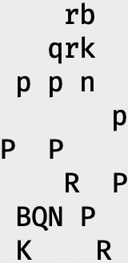
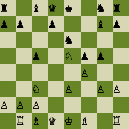
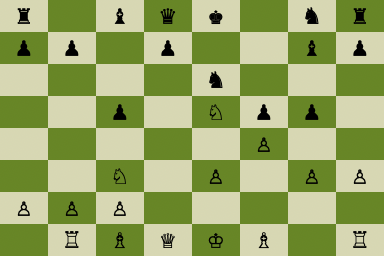

# TEST: images of different aspect ratios in one table row

This row mixes a tall image, a square one, and a wide one. The row height must
be the tallest image's row count, every image must sit inside its own column
between the header underline and the row separator, and none may bleed into the
text around the table. Images scale down to fit their column width.

| Tall (160x328) | Square (256x256) | Wide (384x256) |
| :------------: | :--------------: | :------------: |
|  |  |  |

Text after the table should start cleanly on its own line, with no stray pixels
from the images above.
