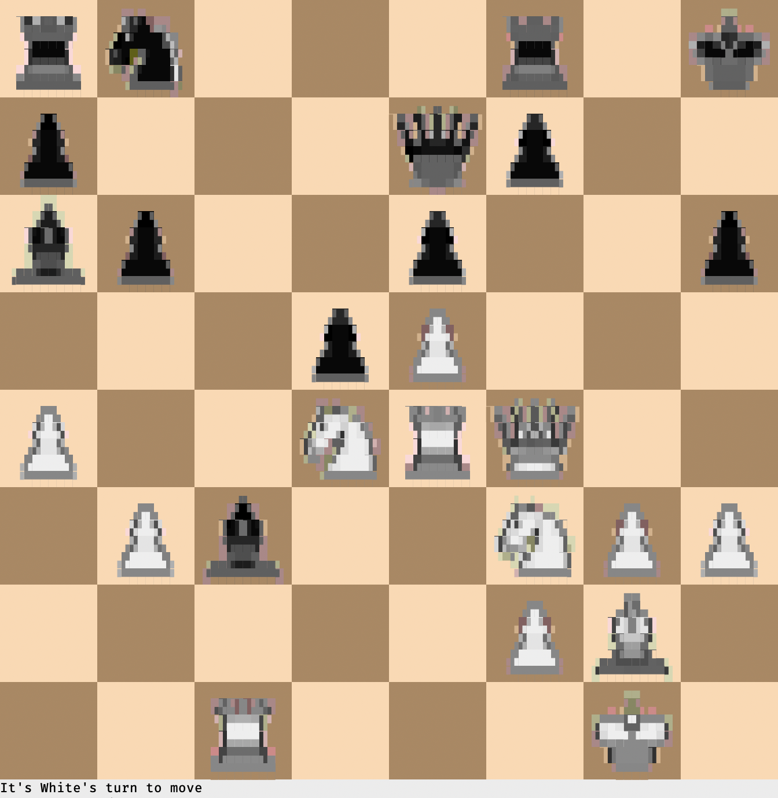
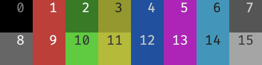
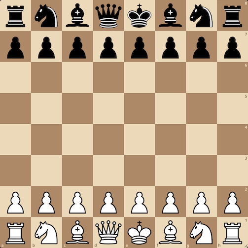

# TEST: image must scale down to a narrow column

Four image columns share the terminal width, so each column is narrow and the
images — some intrinsically large — must scale down to fit their column. No
image may overflow into its neighbor. The widest intrinsic image (m3-1 at
1344x1376) is the real stress case.

| One | Two | Three | Four |
| :-: | :-: | :---: | :--: |
|  |  |  |  |

Wide banner image as a standalone paragraph (regression for non-table images):

Tall image as a standalone paragraph:

