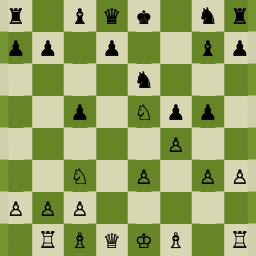

# TEST: text cell taller than the image (text drives row height)

Here a column holds a long paragraph that, once reflowed to its column width,
wraps to more lines than the image column is tall. The row height must be the
TALLER of (tallest reflowed text cell, tallest image). The image should sit at
the top of its cell, the text should fill its lines, and the row separator must
fall below the whole block — not through the image.

| Lots of text | Small image |
| :----------- | :---------: |
| This cell contains enough prose that, after it is reflowed to the column width the table allocates, it wraps onto several lines — more lines than the little image beside it occupies. The row must grow to fit this text, and the image must not be stretched to match; it stays its natural height, top-aligned. |  |

After the table, normal text resumes.
